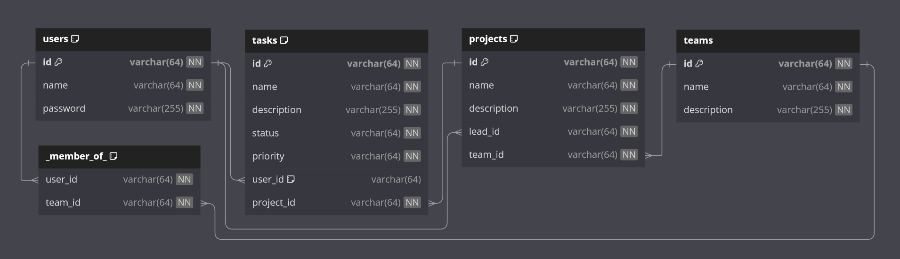
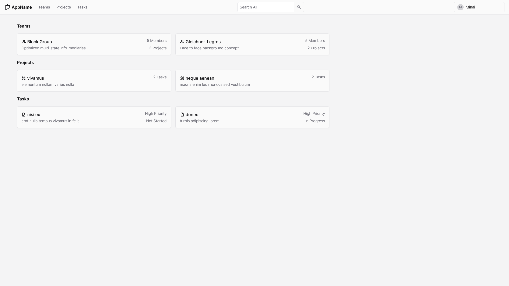
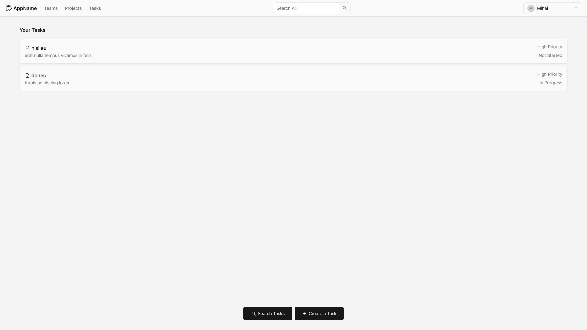
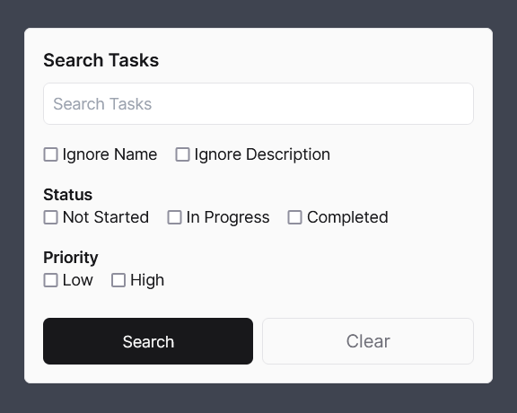
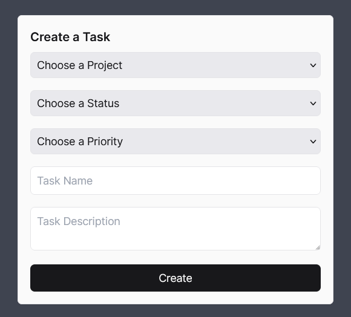
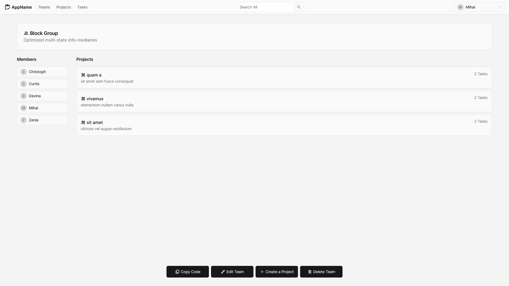

# DB_Final_Project

## 1. Introduction

The project management system is a web application that allows users to create and
manage teams, projects, and tasks.

## 2. Database

### 2.1. Introduction

The database is designed to store information about users, teams, projects, and tasks
in a project management system. For demonstration purposes, the database is filled
with randomly generated sample data. The database has the following tables:

### 2.2. Tables

#### 2.2.1. `users`

| Column Name | Data Type     | Constraints          | 
|-------------|---------------|----------------------|
| `id`        | `VARCHAR(64)` | `PRIMARY KEY`        |
| `name`      | `VARCHAR(64)` | `NOT NULL`, `UNIQUE` |
| `password`  | `VARCHAR(64)` | `NOT NULL`           |

#### 2.2.2. `teams`

| Column Name   | Data Type      | Constraints   |
|---------------|----------------|---------------|
| `id`          | `VARCHAR(64)`  | `PRIMARY KEY` |
| `name`        | `VARCHAR(64)`  | `NOT NULL`    |
| `description` | `VARCHAR(255)` | `NOT NULL`    |

#### 2.2.3. `_member_of_`

| Column Name | Data Type     | Constraints   |
|-------------|---------------|---------------|
| `user_id`   | `VARCHAR(64)` | `FOREIGN KEY` |
| `team_id`   | `VARCHAR(64)` | `FOREIGN KEY` |

#### 2.2.4. `projects`

| Column Name   | Data Type      | Constraints   |
|---------------|----------------|---------------|
| `id`          | `VARCHAR(64)`  | `PRIMARY KEY` |
| `name`        | `VARCHAR(64)`  | `NOT NULL`    |
| `description` | `VARCHAR(255)` | `NOT NULL`    |
| `lead_id`     | `VARCHAR(64)`  | `FOREIGN KEY` |
| `team_id`     | `VARCHAR(64)`  | `FOREIGN KEY` |

#### 2.2.5. `tasks`

| Column Name   | Data Type      | Constraints   |
|---------------|----------------|---------------|
| `id`          | `VARCHAR(64)`  | `PRIMARY KEY` |
| `name`        | `VARCHAR(64)`  | `NOT NULL`    |
| `description` | `VARCHAR(255)` | `NOT NULL`    |
| `status`      | `VARCHAR(64)`  | `NOT NULL`    |
| `priority`    | `VARCHAR(64)`  | `NOT NULL`    |
| `user_id`     | `VARCHAR(64)`  | `FOREIGN KEY` |
| `project_id`  | `VARCHAR(64)`  | `FOREIGN KEY` |

### 2.3. Constraints

#### 2.3.1. `FOREIGN KEY`

| Table        | Column       | Reference Table | Reference Column |
|--------------|--------------|-----------------|------------------|
| `_member_of` | `user_id`    | `users`         | `id`             |
| `_member_of` | `team_id`    | `teams`         | `id`             |
| `projects`   | `lead_id`    | `users`         | `id`             |
| `projects`   | `team_id`    | `teams`         | `id`             |
| `tasks`      | `user_id`    | `users`         | `id`             |
| `tasks`      | `project_id` | `projects`      | `id`             |

#### 2.3.2. `UNIQUE`

| Table   | Column |
|---------|--------|
| `users` | `name` |

## 3. Frontend

### 3.1. Introduction

The web application frontend provides pages that serve as the user interface for the
project management system. The pages are designed to allow users to interact with the
database.

### 3.2. Pages

#### 3.2.1. `/auth`

This page allows users to create an account or log in to an existing account. It
includes two input fields for the username and password, a button to view the
password, a button to toggle between the login and signup forms, and a button to
submit the form. The page is shown below:

#### 3.2.2. `/`

This page serves as the home page for the web application. It includes a
navigation bar with links to the `/teams`, `/projects`, and `/tasks` pages, an
account dropdown menu with a logout button, a short list of the user's main teams,
projects and tasks, and a search bar. The page is shown below:

#### 3.2.3. `/teams`, `/projects`, `/tasks`

These pages display a list of the user's teams, projects, and tasks, respectively.
They include buttons for creating items, as well as searching and filtering
options. The page shown below is the `/tasks` page, as it has the most features:

#### 3.2.4. `/team/?id`, `/project/?id`, `/task/?id`

These pages display detailed information about a specific team, project, or task,
as well as buttons for editing and deleting the item and creating new items within
it (if applicable). The page shown below is the `/team/?id` page:

## 4. Backend

### 4.1. Introduction

The web application backend is a collection of PHP readonly classes that map to
database tables, as well as helper abstract classes that provide a common interface
for usual operations.

### 4.2. Read-Only Classes

#### 4.2.1. `User`

##### 4.2.1.1. Attributes

| Field Name | Data Type |
|------------|-----------|
| `id`       | `string`  |
| `name`     | `string`  |
| `password` | `string`  |

##### 4.2.1.2. Methods

| Method Name    | Called On | Parameters                         | Return Type | Description                                                                               |
|----------------|-----------|------------------------------------|-------------|-------------------------------------------------------------------------------------------|
| `router`       | Class     |                                    | `void`      | Calls appropriate methods based on the request method and parameters, and handles errors. |
| `register`     | Class     | `string $name`, `string $password` | `User`      | Registers a new user.                                                                     |
| `login`        | Class     | `string $name`, `string $password` | `User`      | Logs in an existing user.                                                                 |
| `add`          | Class     | `string $name`, `string $password` | `?User`     | Adds a new user to the database                                                           |
| `get`          | Class     | `string $identifier`               | `?User`     | Retrieves a user from the database, either by ID or name.                                 |                        
| `get_teams`    | Instance  |                                    | `Team[]`    | Retrieves the teams that the user is a member of.                                         |
| `get_projects` | Instance  |                                    | `Project[]` | Retrieves the projects that the user is a member of.                                      |
| `get_tasks`    | Instance  |                                    | `Task[]`    | Retrieves the tasks that the user is assigned to, as well as unassigned tasks.            |

#### 4.2.2. `Team`

##### 4.2.2.1. Attributes

| Field Name    | Data Type |
|---------------|-----------|
| `id`          | `string`  |
| `name`        | `string`  |
| `description` | `string`  |

##### 4.2.2.2. Methods

| Method Name    | Called On | Parameters                                                 | Return Type | Description                                                                               |
|----------------|-----------|------------------------------------------------------------|-------------|-------------------------------------------------------------------------------------------|
| `router`       | Class     |                                                            | `void`      | Calls appropriate methods based on the request method and parameters, and handles errors. |
| `add`          | Class     | `string $name`, `string $description`                      | `?Team`     | Adds a new team to the database.                                                          |
| `get`          | Class     | `string $id`                                               | `?Team`     | Retrieves a team from the database.                                                       |
| `get_members`  | Instance  |                                                            | `User[]`    | Retrieves the users that are members of the team.                                         |
| `get_projects` | Instance  |                                                            | `Project[]` | Retrieves the projects that belong to the team.                                           |
| `update`       | Instance  | `?string $name`, `?string $description`                    | `Team`      | Updates the team's name and description.                                                  |
| `remove`       | Instance  |                                                            | `bool`      | Deletes the team from the database.                                                       |
| `search`       | Class     | `string $query`, `?bool $in_name`, `?bool $in_description` | `Team[]`    | Searches for teams based on the query.                                                    |

#### 4.2.3. `Project`

##### 4.2.3.1. Attributes

| Field Name    | Data Type |
|---------------|-----------|
| `id`          | `string`  |
| `name`        | `string`  |
| `description` | `string`  |
| `lead`        | `User`    |
| `team`        | `Team`    |

##### 4.2.3.2. Methods

| Method Name | Called On | Parameters                                                 | Return Type | Description                                                                               |
|-------------|-----------|------------------------------------------------------------|-------------|-------------------------------------------------------------------------------------------|
| `router`    | Class     |                                                            | `void`      | Calls appropriate methods based on the request method and parameters, and handles errors. |
| `add`       | Class     | `string $name`, `string $description`                      | `?Project`  | Adds a new project to the database.                                                       |
| `get`       | Class     | `string $id`                                               | `?Project`  | Retrieves a project from the database.                                                    |
| `get_tasks` | Instance  |                                                            | `Task[]`    | Retrieves the tasks that belong to the project.                                           |
| `update`    | Instance  | `?string $name`, `?string $description`                    | `Project`   | Updates the project's name and description.                                               |
| `remove`    | Instance  |                                                            | `bool`      | Deletes the project from the database.                                                    |
| `search`    | Class     | `string $query`, `?bool $in_name`, `?bool $in_description` | `Project[]` | Searches for projects based on the query.                                                 |

#### 4.2.4. `Task`

##### 4.2.4.1. Attributes

| Field Name    | Data Type      |
|---------------|----------------|
| `id`          | `string`       |
| `name`        | `string`       |
| `description` | `string`       |
| `project`     | `Project`      |
| `status`      | `TaskStatus`   |
| `priority`    | `TaskPriority` |
| `user`        | `?User`        |

##### 4.2.4.2. Methods

| Method Name | Called On | Parameters                                                                                                                    | Return Type | Description                                                                               |
|-------------|-----------|-------------------------------------------------------------------------------------------------------------------------------|-------------|-------------------------------------------------------------------------------------------|
| `router`    | Class     |                                                                                                                               | `void`      | Calls appropriate methods based on the request method and parameters, and handles errors. |
| `add`       | Class     | `string $name`, `string $description`, `Project $project`, `?User $user`, `TaskStatus $status`, `TaskPriority $priority`      | `?Task`     | Adds a new task to the database.                                                          |
| `get`       | Class     | `string $id`                                                                                                                  | `?Task`     | Retrieves a task from the database.                                                       |
| `update`    | Instance  | `?string $name`, `?string $description`, `?Project $project`, `?User $user`, `?TaskStatus $status`, `?TaskPriority $priority` | `Task`      | Updates the task's name, description, project, user, status, and priority.                |
| `remove`    | Instance  |                                                                                                                               | `bool`      | Deletes the task from the database.                                                       |
| `search`    | Class     | `string $query`, `?TaskStatus[] $statuses`, `?TaskPriority[] $priorities`, `?bool $in_name`, `?bool $in_description`          | `Task[]`    | Searches for tasks based on the query.                                                    |

##### 4.2.4.3. Enumerations

###### 4.2.4.3.1. `TaskStatus`

| Case Name    | Value       | Description                    |
|--------------|-------------|--------------------------------|
| `NotStarted` | Not Started | The task has not been started. |
| `InProgress` | In Progress | The task is in progress.       |
| `Completed`  | Completed   | The task has been completed.   |

###### 4.2.4.3.2. `TaskPriority`

| Case Name | Value | Description                 |
|-----------|-------|-----------------------------|
| `Low`     | Low   | The task has low priority.  |
| `High`    | High  | The task has high priority. |

### 4.3. Abstract Classes

#### 4.3.1. `Database`

| Method Name   | Parameters                               | Return Type                                     | Description                                |
|---------------|------------------------------------------|-------------------------------------------------|--------------------------------------------|
| `generate_id` |                                          | `string`                                        | Generates a random UUID.                   |
| `query`       | `string $query_string`, `?array $params` | `?["result"]: mixed`, `?["affected_rows"]: int` | Executes a query with optional parameters. |

#### 4.3.2. `Session`

| Method Name | Parameters                    | Return Type | Description                                  |
|-------------|-------------------------------|-------------|----------------------------------------------|
| `init`      |                               | `void`      | Starts a new session.                        |
| `get`       | `?string $key`                | `?mixed`    | Retrieves a session variable or all of them. |
| `set`       | `string $key`, `mixed $value` | `void`      | Sets a session variable.                     |
| `unset`     | `?string $key`                | `void`      | Unsets a session variable or all of them.    |

#### 4.3.3. `Request`

| Method Name | Parameters    | Return Type | Description                            |
|-------------|---------------|-------------|----------------------------------------|
| `method`    |               | `string`    | Retrieves the request method.          |
| `get`       | `string $key` | `?string`   | Retrieves a GET parameter.             |
| `post`      | `string $key` | `?string`   | Retrieves a POST parameter.            |
| `get_array` | `string $key` | `?array`    | Retrieves a GET parameter as an array. |